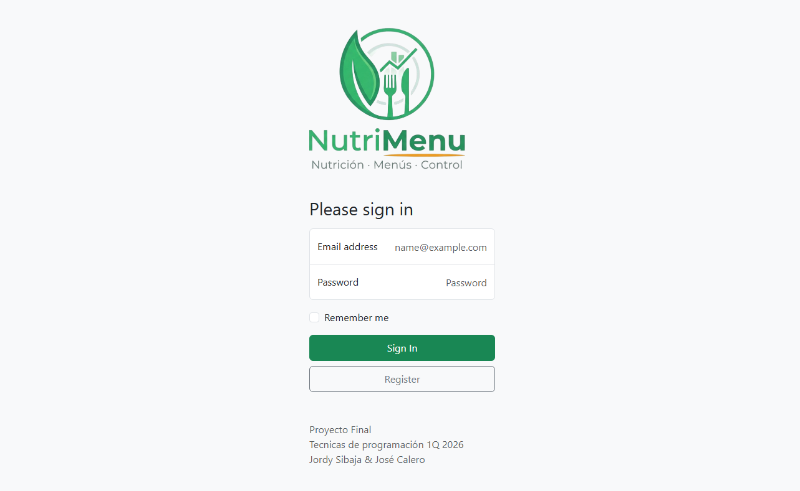
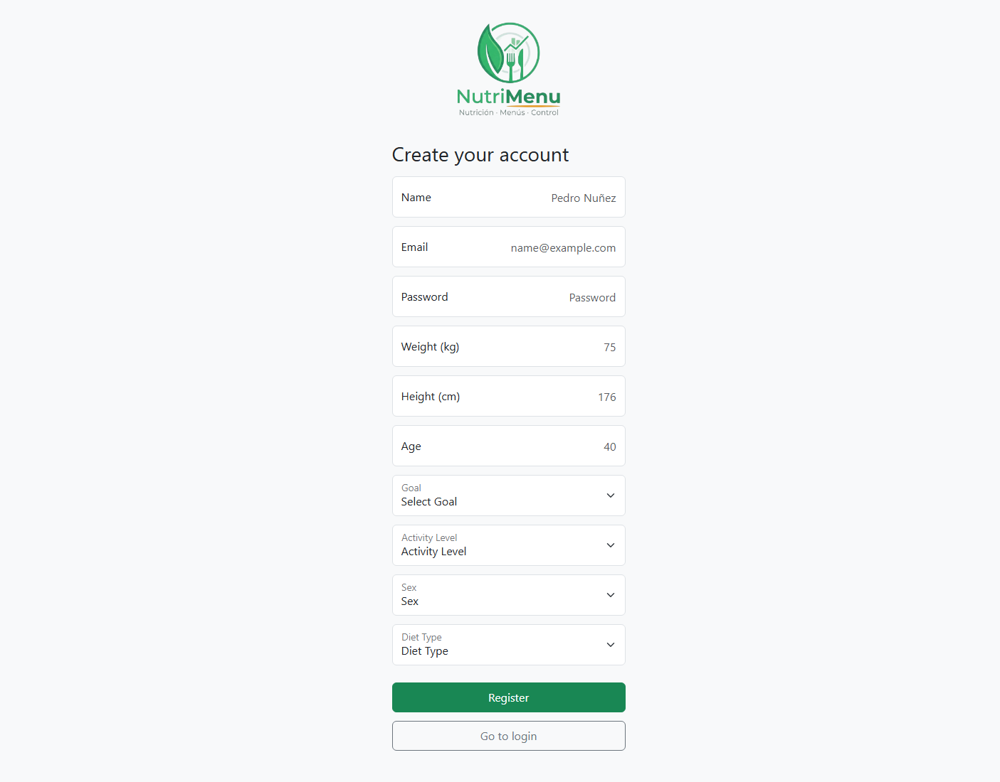
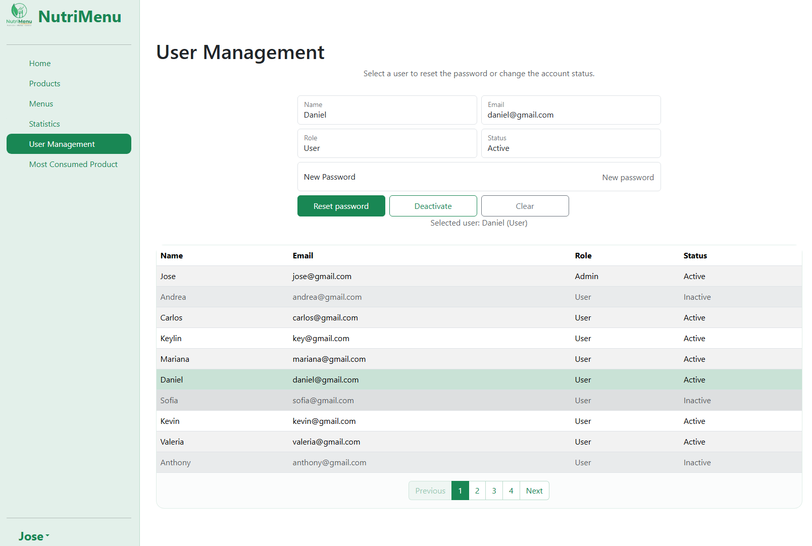
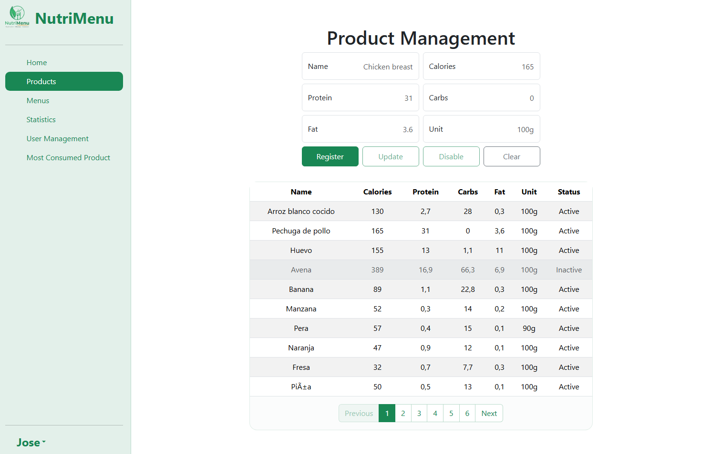
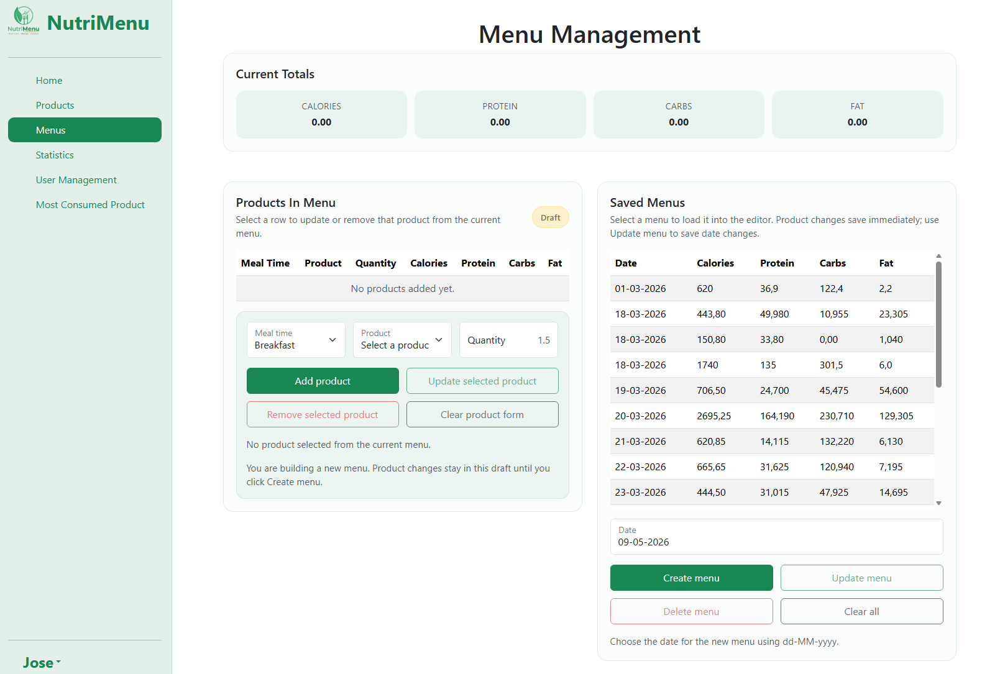
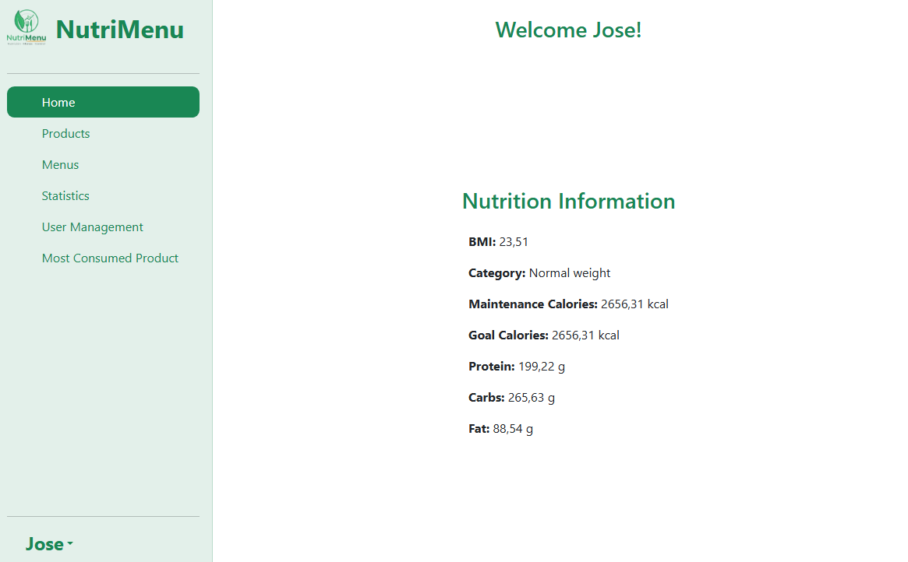
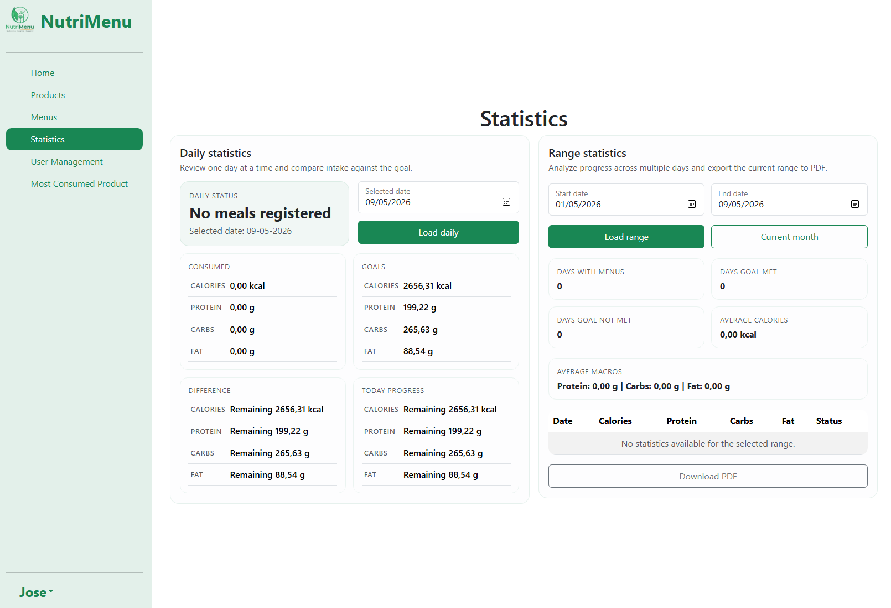

# TP-P1-Nutricion

Aplicación de gestión nutricional desarrollada en C# con .NET, con una versión actual en Blazor Server y una base funcional también en Windows Forms para registrar usuarios, productos, menús e indicadores nutricionales.

## Descripción

`Nutrición para todos` es un sistema orientado a apoyar el control de la alimentación diaria de un usuario. La aplicación permite:

- registrar e iniciar sesión con usuarios
- administrar productos alimenticios y su información nutricional
- crear, actualizar y eliminar menús diarios por tiempos de comida
- visualizar información nutricional personal
- consultar estadísticas nutricionales por día, mes y rango de fechas
- identificar el producto más consumido
- exportar reportes estadísticos en PDF

El proyecto se desarrolló aplicando principios de programación orientada a objetos, MVC, separación por capas, SOLID y buenas prácticas de Clean Code. Actualmente el repositorio refleja una evolución del sistema hacia una interfaz web con Blazor Server, manteniendo además una versión de escritorio con Windows Forms.

## Tecnologías utilizadas

- C#
- .NET 10
- Blazor Server
- Windows Forms
- CSV como persistencia local
- QuestPDF
- MSTest
- Moq
- Sonar Analyzer

## Estructura del proyecto

- `src/ClassModels`
  Contiene las entidades del sistema como `User`, `Product`, `Menu`, `MenuProduct` y los modelos de estadísticas nutricionales.

- `src/ClassController`
  Contiene la lógica de negocio, validaciones, cálculos nutricionales y manejo de archivos.

- `src/ClassBlazor`
  Contiene la interfaz web principal del proyecto desarrollada con componentes Razor y Blazor Server.

- `src/ClassViews`
  Contiene las vistas de Windows Forms y la composición principal de la aplicación de escritorio.

- `test/ClassControllerTest`
  Contiene pruebas unitarias para controladores y lógica de negocio.

- `data`
  Contiene los archivos CSV con usuarios, productos, menús y productos por menú.

- `Documentación`
  Contiene el entregable inicial, documentación técnica y documentación generada del proyecto.

## Funcionalidades principales

### Gestión de usuarios

- registro de usuario
- inicio de sesión
- almacenamiento de datos físicos y objetivo nutricional
- gestión de usuarios desde el panel principal

<p align="center">
  
  
</p>

<p align="center">
  
</p>

### Gestión de productos

- registro de productos
- edición de productos
- activación y desactivación de productos
- base inicial de 50 productos

<p align="center">
  
</p>

### Gestión de menús

- creación de menús por fecha
- asociación de productos por tiempo de comida
- actualización y eliminación de menús
- cálculo automático de calorías y macronutrientes

<p align="center">
  
</p>

### Información nutricional

- calorías de mantenimiento
- calorías objetivo según meta
- distribución de macronutrientes
- cálculo de IMC y categoría

<p align="center">
  
</p>

### Estadísticas nutricionales

- consumo diario de calorías
- consumo diario de proteínas, carbohidratos y grasas
- comparación con meta diaria
- progreso del día
- estadísticas por rango de fechas
- conteo mensual de cumplimiento
- exportación de estadísticas en PDF
- consulta del producto más consumido

<p align="center">
  
</p>

## Datos incluidos

La aplicación incluye archivos de datos con cantidades suficientes para pruebas y demostración del sistema:

- más de 25 usuarios
- 50 productos
- más de 100 registros de comidas
- registros distribuidos en múltiples fechas

## Requisitos para ejecutar

### Opción web actual

- .NET SDK 10

### Opción de escritorio

- Windows
- Visual Studio 2022 o superior con soporte para .NET y Windows Forms
- .NET SDK 10

## Cómo ejecutar

### Ejecutar la versión web en Blazor

1. Clonar el repositorio.
2. Abrir una terminal en la raíz del proyecto.
3. Ejecutar:

```powershell
dotnet run --project src/ClassBlazor/ClassBlazor.csproj
```

4. Abrir en el navegador la URL local que muestre la terminal.

### Ejecutar la versión de escritorio en Windows Forms

1. Clonar el repositorio.
2. Abrir `ClassViews.slnx` en Visual Studio.
3. Verificar que el proyecto de inicio sea `ClassViews`.
4. Ejecutar con `F5` o `Ctrl + F5`.

También puedes compilar desde terminal con:

```powershell
dotnet build ClassViews.slnx
```

## Archivos de persistencia

La aplicación utiliza archivos CSV para cargar y guardar información:

- `data/users.csv`
- `data/products.csv`
- `data/menus.csv`
- `data/menuProducts.csv`

## Flujo de uso recomendado

1. Registrar un usuario o iniciar sesión.
2. Revisar o registrar productos en `Manage Products`.
3. Crear o modificar menús en `Manage Menus`.
4. Consultar métricas personales en `Nutrition Info`.
5. Consultar estadísticas en `Statistics`.

## Documentación

La carpeta `Documentación` contiene:

- `Entregable #1.pdf`
- `Documentacion Tecnica Final.pdf`
- `Documentacion Tecnica Final V2.pdf`

